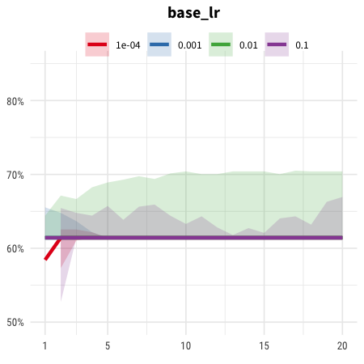
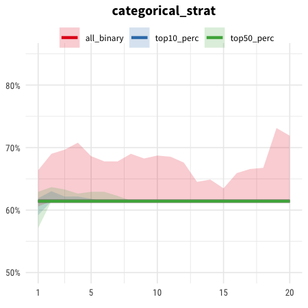
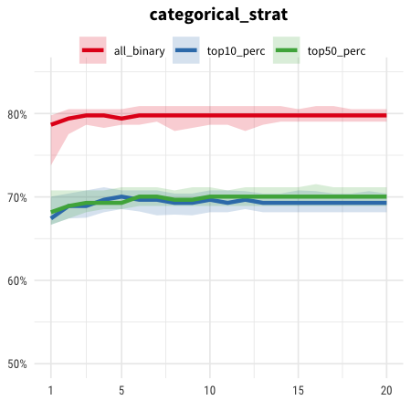

# titanic


Author's note: Deep learning may be overkill for a small dataset like the Titanic dataset, but it's good for benchmarking.

```
Modeling with field specifications:
Pclass: categorical
Name: ignore
Sex: categorical
Age: numeric
Siblings/Spouses Aboard: categorical
Parents/Children Aboard: categorical
Fare: numeric
```

## TensorFlow

Ran with automl-gs 0.2 using the command:

```shell
automl_gs titanic.csv Survived --num_trials 1000
```

On my personal MacBook (quad-core CPU), training took 1:39:38. (avg 5.98s per trial)

Winning results:

```                                                              
trial_id: eedfd007-d066-45a7-9d8c-52ab8bdfc028
epoch: 20
time_completed: 2019-03-25 16:42:55
log_loss: 0.5750503522179993
accuracy: 0.8352059925093633
auc: 0.8219867392848685
precision: 0.83620689655172423
recall: 0.8116860052095667
f1: 0.8202570379436964
```

Notable hyperparameters where the results differ strongly:





## xgboost

Ran with automl-gs 0.2 using the command:

```shell
automl_gs titanic.csv Survived --framework xgboost --num_trials 1000
```

On my personal MacBook (quad-core CPU), training took 23:12. (avg 1.39s per trial)

```
trial_id: 7c32e30f-8436-4d37-b881-3d0edaf06432
epoch: 20
time_completed: 2019-03-25 14:59:40
log_loss: 0.4617261451281858
accuracy: 0.8389513108614233
auc: 0.8337674638882311
precision: 0.8634615384615385
recall: 0.8020956665877339
f1: 0.8172542777556706
```

Notable hyperparameters where the results differ strongly:


